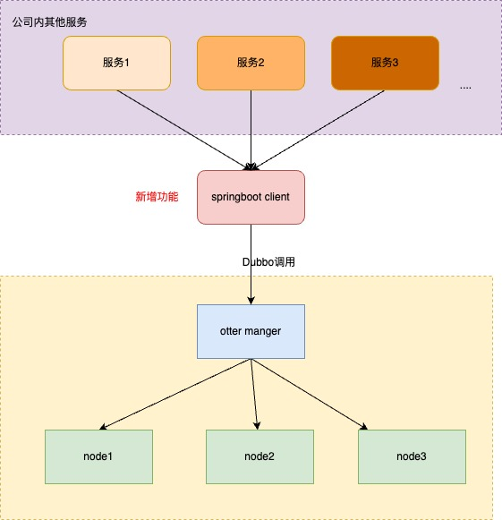

<h1>环境搭建 & 打包</h1>
<strong>环境搭建：</strong>
<ol>
<li>进入 $otter_home/lib 目录</li>
<li>执行：bash install.sh</li>
</ol>
<strong>打包：</strong>
<ol>
<li>进入$otter_home目录</li>
<li>执行：mvn clean install -Dmaven.test.skip -Denv=release</li>
<li>发布包位置：$otter_home/target</li>
</ol>

<h1>
<a name="%E9%A1%B9%E7%9B%AE%E8%83%8C%E6%99%AF" class="anchor" href="#%E9%A1%B9%E7%9B%AE%E8%83%8C%E6%99%AF"></a>项目背景</h1>

   &nbsp;&nbsp;&nbsp;阿里巴巴B2B公司，因为业务的特性，卖家主要集中在国内，买家主要集中在国外，所以衍生出了杭州和美国异地机房的需求，同时为了提升用户体验，整个机房的架构为双A，两边均可写，由此诞生了otter这样一个产品。 

   &nbsp;&nbsp;&nbsp;otter第一版本可追溯到04~05年，此次外部开源的版本为第4版，开发时间从2011年7月份一直持续到现在，目前阿里巴巴B2B内部的本地/异地机房的同步需求基本全上了otter4。

<strong>目前同步规模：</strong>
<ol>
<li>同步数据量6亿</li>
<li>文件同步1.5TB(2000w张图片)</li>
<li>涉及200+个数据库实例之间的同步</li>
<li>80+台机器的集群规模</li>
</ol>
<h1>
<a name="%E9%A1%B9%E7%9B%AE%E4%BB%8B%E7%BB%8D" class="anchor" href="#%E9%A1%B9%E7%9B%AE%E4%BB%8B%E7%BB%8D"></a>项目介绍</h1>

名称：otter ['ɒtə(r)]

译意： 水獭，数据搬运工

语言： 纯java开发

定位： 基于数据库增量日志解析，准实时同步到本机房或异地机房的mysql/oracle数据库. 一个分布式数据库同步系统

 

<h1>项目改造</h1>

    基于Otter master分支最新提交，增加client工程，目标是为公司内springboot项目通过HTTP调用或者Dubbo调用操作Otter manager，实现任务创建和启动停止等

<strong>改造内容：</strong>
<ol>
<li>新增springboot client工程</li>
<li>jdk版本升级为1.8</li>
<li>使用springboot 2.3.2.RELEASE，大家可通过RESTful接口调用 Otter manager模块</li>
</ol>

<strong>打包：</strong>
<ol>
<li>进入$otter_home目录</li>
<li>执行：mvn clean install -Dmaven.test.skip -Denv=release</li>
<li>发布包位置：$otter_home/target</li>
</ol>

<strong>部署Otter manager：</strong>
<ol>
<li>按照官方文档部署Otter的manager和node，https://github.com/alibaba/otter/wiki/QuickStart</li>
</ol>

<strong>解压：</strong>
<ol>
<li>进入$otter_home/target目录</li>
<li>执行：mkdir client && tar -xf client.deployer-4.2.19-SNAPSHOT.tar.gz -C client  </li>
<li>启动脚本位置：$otter_home/target/client/bin/start.sh</li>
<li>修改manager端口：$otter_home/target/client/conf/application.yml，默认是 127.0.0.1:1099，请改成你部署的Otter manager地址</li>
</ol>

<strong>启动 springboot client：</strong>
<ol>
<li>进入$otter_home/target/client目录</li>
<li>启动脚本位置：bin/startup.sh</li>
<li>执行启动脚本：sh bin/startup.sh </li>
<li>测试调用：在命令行窗口输入curl --location 'http://localhost:8100/nodetest/node/1' 或者 浏览器地址栏输入 http://localhost:8100/nodetest/node/1，
 返回 node 节点的信息表示成功：
 Node[id=1,name=test-node1,ip=127.0.0.1,port=2088,status=START,description=<null>,parameters=NodeParameter[mbeanPort=2090,downloadPort=2089,zkCluster=AutoKeeperCluster[id=1,clusterName=test-zk,serverList=[10.23.104.43:2181],description=<null>,gmtCreate=2023-07-29 14:55:06,gmtModified=2023-08-23 19:48:22],externalIp=127.0.0.1,useExternalIp=false],gmtCreate=2023-07-29 14:56:14,gmtModified=2023-08-01 10:51:56]
</li>
<li>执行关闭脚本停止client：sh bin/stop.sh
 Oook! cost:2
</li>
</ol>
