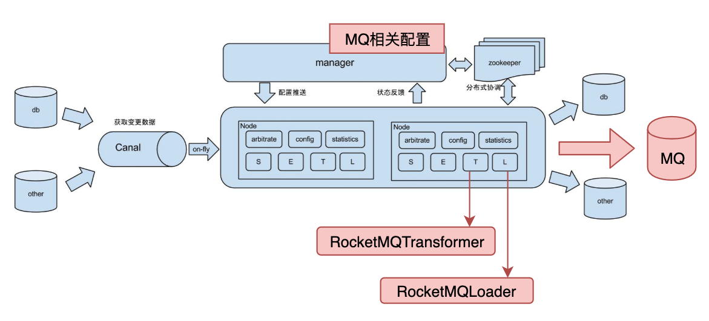

最近接到了一个需求，需要同步业务数据库至MQ，再进行相应的操作。

对于这种需求，其实阿里巴巴出品的canal（https://github.com/alibaba/canal） 就可以做到，但是领导提出了更变态的需求，需要有前端界面，可以动态配置，读取什么表，发送到哪个MQ，哪个topic，哪个tag，还得需要有监控界面，查看每个时间段同步的数据，对于这种可配置的需求，阿里巴巴otter（https://github.com/alibaba/otter） 可以完美做到，可是otter内置的canal阉割了发送到kafka和RocketMQ的功能。再三调研和判断后，我们还是决定对otter进行改造，将阉割了的发送MQ功能，给它装回去。

## 熟悉源码
```shell
git clone https://github.com/alibaba/otter.git
cd otter
```
下载源码后，我们使用Idea打开项目，引入Maven包，可以看到目录如下：

```html
otter
|--manager
    |--biz
    |--deployer
    |--web
|--node
    |--canal
    |--common
    |--deployer
    |--etl
    |--extend
|--shared
    |--arbitrate
    |--common
    |--communication
    |--etl
    |--push
```
### Manager
manager是对node节点进行管理，数据统计，node节点之间的协调，基本信息的同步等。

* biz：业务处理内容
* deployer：manager打包和启动的类，主要内置一个jetty的服务启动器，通过OtterManagerLauncher启动
* web：manager的web页面相关内容，包括接口

### Node
node是实际上进行数据同步的工程

* canal：canal客户端，就是订阅binlog的客户端，Otter采用的是Embed的方式引入Canal
* common：公共内容定义
* deployer：打包工具，运行脚本，内置jetty服务器，启动类OtterLauncher
* etl：S.E.T.L 调度、处理的实现，是Otter最复杂、也是最核心的部分
* extend：留有的扩展类，可以自定义一些处理过程

### Shared
shared是manager和node公有的子系统

* arbitrate：仲裁器相关内容，代码比较多，后面我们慢慢分析
* common：manager和node用到的一些公共类
* communication：远程调用相关内容
* etl
* push
以上部分来自博文：https://www.cnblogs.com/f-zhao/p/8328987.html

改造方案
根据otter的github主页图，可以很清晰的了解otter的运行模式和结构。


阅读了官方文档：https://github.com/alibaba/otter/wiki/Otter扩展性 ，我们对otter的扩展性有了一定了解

为了增加MQ的功能，主要还是要对T（transformer）和L（load）进行改造

同时需要对manager进行二次开发，以满足配置MQ的需求。

所以改造的功能图如下所示：



接下来就是对Manager进行改造了。