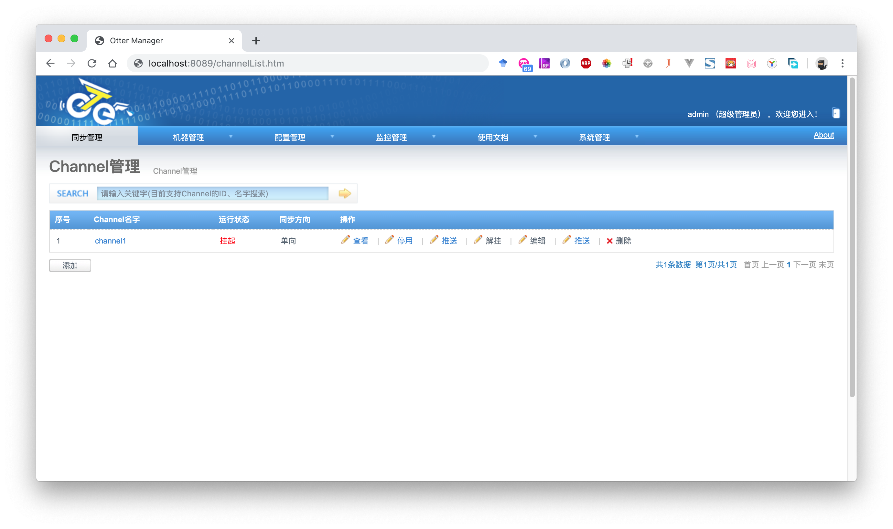
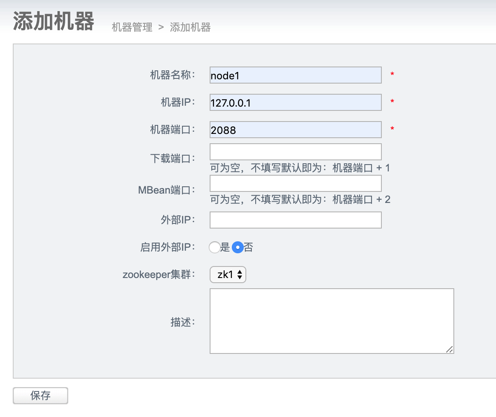
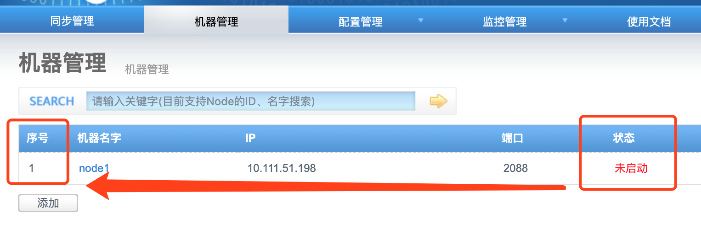
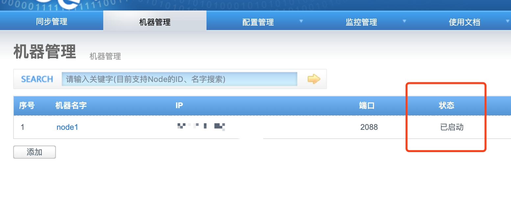

这篇我们将改造后的代码进行编译和部署，随后进行测试。

### 打包
otter已经把打包的shell脚本写好了，查看目录docker/build.sh

```shell
#!/bin/bash
# 省略不相关命令...
else
rm -rf $BASE/node.*.tar.gz ;
rm -rf $BASE/manager.*.tar.gz ;
cd $BASE/../ && mvn clean package -Dmaven.test.skip -Denv=release && cd $current_path ;
cp $BASE/../target/node.deployer-*.tar.gz $BASE/
cp $BASE/../target/manager.deployer-*.tar.gz $BASE/
#    docker build --no-cache -t canal/otter-all $BASE/
fi
```
将docker build 的语句注释，执行sh docker.sh即可进行打包，打包完成后会在当前目录下生成manager和node两个tar.gz，我们将其远程传输到服务器中：

```shell
scp manager.deployer-4.2.18-SNAPSHOT.tar.gz root@ip:~/otter
scp node.deployer-4.2.18-SNAPSHOT.tar.gz root@ip:~/otter
```
### 部署
进入部署服务器，使用tar解压：
```shell
cd ~/otter
mkdir manager
mkdir node
tar zxvf manager.deployer-4.2.18-SNAPSHOT.tar.gz -C manager
tar zxvf node.deployer-4.2.18-SNAPSHOT.tar.gz -C node
```
### 导入数据库文件
manager运行时需要依赖MySQL保存配置信息，根据文档Manager_Quickstart我们需要下载ddl文件进行数据库部署：

```shell
wget https://raw.github.com/alibaba/otter/master/manager/deployer/src/main/resources/sql/otter-manager-schema.sql
mysql -h localhost -uroot -p
```
执行DDL：
```shell
mysql > create database otter;
mysql > use otter;
mysql > source /root/otter/otter-manager-schema.sql;
mysql > exit;
```

### 部署manager
进入manager目录，修改conf/otter.properties文件，填写必须的参数：

```properties
## otter manager domain name
otter.domainName = 127.0.0.1
## otter manager http port
otter.port = 8080
## otter manager database config
otter.database.driver.class.name = com.mysql.jdbc.Driver
otter.database.driver.url = jdbc:mysql://127.0.0.1:3306/otter
otter.database.driver.username = root
otter.database.driver.password = root
```
保存后，执行部署
```shell
sh ./bin/startup.sh
```
打开浏览器，输入ip:8080，查看是否可以看到otter管理后台：



日志可以在manager/logs/manager.log中查看，管理员默认的账号密码为admin:admin，记得修改密码，不然有安全隐患。

### 配置Zookeeper
打开manager管理后台，以管理员账号登录，点击机器管理-Zookeeper管理，点击添加，输入集群信息，点击保存。这步必须执行，之后部署Node需要用到。

### 部署Node
打开manager管理后台，以管理员账号登录，点击机器管理-Node管理，点击添加，输入Node相关信息：



点击保存，可以得到保存好的Node节点，且状态为未启动：



复制序号列下的内容，图中为1。打开服务器后台，进入目录node
```shell
cd ~/otter/node
echo 1 > conf/nid
```
这样就表示这个Node是为了上图这个Node而配置的，然后启动Node：

```shell
./bin/startup.sh
```
刷新后台，可以看到Node状态为已启动



到此为止，我们的Manager和Node已经部署完毕。